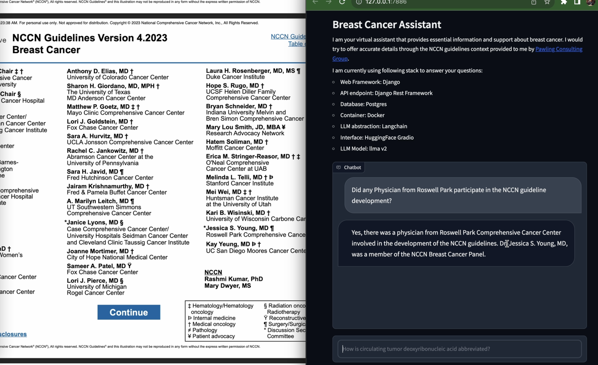

# cancerllm

This django framework tries to ingest documents related to NCCN guidlines and drives the LLM using contextual injection method.

Most of the important code is part of llmutils.py under core app of this project.

In order to have the DRF endpoint run with the LLM chat capability, OPEN_AI_KEY from the settings.py file needs to be set with the right api key.

This is a dockerized application so when the app is run, it would be hosted at http://localhost:8009/llm/ because the internal default port of django has been mapped to 8009 of local machine.

Following are the steps to run this web application with LLM Chat endpoint

1) git clone the repository
2) docker-compose build
3) docker-compose up
4) run the gradio.ipynb notebook to start the chat interface in a browser tab

# Stack information

1) Django
2) Django Rest Framework
3) HuggingFace Gradio
4) Langchain
5) Postgresql (temporary shipment of sqlite in the repo for quick demo)
6) Docker
7) OpenAI
8) LLAMA 7B chat ( in progress )

# Number of developers needed: 1

# Time it took to get this done: 8 hrs

# Special considerations:

1) Focussed search across documents
2) Context driven response. Injection at the time of response using Faiss vector db.
3) Character split for better recognition of abbreviations.

# TODOs:

1) Addition of different document types
2) Querying straight on top of database using LLM
3) Addition of llama for running free queries
